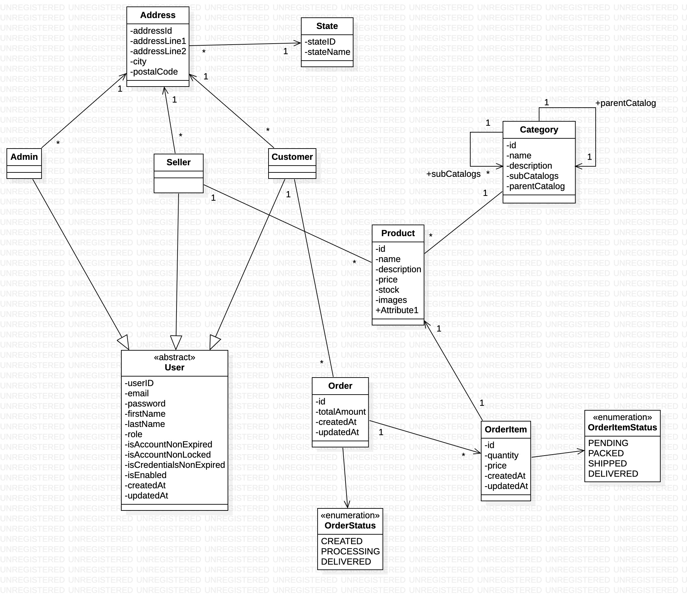

# Problem Statement: Alpha Online Shopping System

## Current Issue

- Online shopping platforms often face multiple issues that hinder a smooth shopping experience, including:
    - **Complex Navigation**: Users may struggle to find specific products quickly due to poorly organized categories or
      limited search capabilities.
    - **Limited Product Information**: Many platforms do not provide detailed descriptions, specifications, or quality
      images, leading to customer dissatisfaction.
    - **Lack of Useful Product Suggestions**: Generic or irrelevant recommendations make it harder for customers to find
      products they’re interested in.
    - **Inaccurate Stock Availability**: Customers may encounter "out-of-stock" messages after selecting a product,
      leading to frustration and potential loss of sales.
    - **Ineffective Inventory Management**: Sellers and admins lack an easy way to manage product listings, prices, and
      stock quantities, impacting inventory accuracy and availability.
    - **Role-Specific Challenges**: Current platforms rarely differentiate between the needs of admins, sellers, and
      customers, leading to cluttered interfaces and lack of specific permissions.
    - **Complicated Checkout Process**: A lengthy or confusing checkout can lead to abandoned carts and a negative user
      experience.

## Project Context

- "Alpha Online Shopping" aims to create a simple and organized platform that offers a tailored experience for different
  types of users: Admin, Seller, and Customer. This approach will make it easier for customers to shop, sellers to
  manage their products, and admins to oversee the platform.

## Project Goal

- Create a shopping platform that:
    - **User Roles**:
        - **Admin**: Has full control, including managing user accounts, overseeing all products, and performing CRUD
          operations on products from all sellers.
        - **Seller**: Can add, update, and delete their products in the system, with access to their inventory and sales
          data.
        - **Customer**: Can browse products, view availability, add items to a cart, and complete purchases.
    - **Product Recommendations**: Offers simple recommendations for customers, such as:
        - Best Sellers, Trending Products, and New Arrivals
    - **Inventory Information**: Displays clear stock availability to improve the shopping experience.
    - **CRUD Functionality on Products**:
        - Allows admins to perform full CRUD on all products and sellers to manage their listings (create, read, update,
          and delete products).
    - **Checkout Process**: Provides customers with a smooth, simple checkout process.

## Desired Outcome

- Improve user satisfaction by creating a well-structured platform with tailored access for admins, sellers, and
  customers. This includes an easy product catalog update process, helpful product recommendations, and accurate
  inventory information to support user needs and platform growth.

# Architecture

URL- [Miro](https://miro.com/app/board/uXjVLLaCK1s=/?share_link_id=877918259717)

# Class Diagram

# ER Diagram

# API Design

## Admin Controller

- POST {{host}}/api/v1/admin/register
- GET {{host}}/api/v1/admin/me

## AuthenticationController

- POST {{host}}/api/v1/auth/login

## Seller Controller

- POST {{host}}/api/v1/seller/register
- GET {{host}}/api/v1/seller/me

## Customer Controller

- POST {{host}}/api/v1/customer/register
- GET {{host}}/api/v1/customer/me

## Catalog Controller

- GET {{host}}/api/v1/catalogs
- GET {{host}}/api/v1/catalogs/{{catalogId}}
- POST {{host}}/api/v1/catalogs
    - Create Catalog
    - Handled If the catalog name already exist, throw error
- PUT {{host}}/api/v1/catalogs/{{CatalogId}}
    - Update Catalog
    - Error Handler
        - if the catalog id not found
        - if the catalog name already exist
        - if the catalog has product
- DELETE
    - Delete Catalog
    - Error Handler
        - if the catalog id not found
        - if the catalog has product

## Product Controller

- POST {{host}}/api/v1/products
- GET {{host}}/api/v1/products/{{productId}}
- GET {{host}}/api/v1/products?catalogId={{catalogId}}&productName={{productId}}&sortBy=name&sortDirection=desc&page=1&size=2

## Order Controller

- POST {{host}}/api/v1/orders
    - create orders, only for customer
- GET {{host}}/api/v1/orders
    - When customer call this → will get customer’s orders
    - When admin call this → Will get all the orders
- GET {{host}}/api/v1/orders/items
    - Get All orderItems for each seller
- GET {{host}}/api/v1/orders/{{orderId}}
    - this api is for only Admin and Customer
    - Admin can see all the orders freely
    - but customer can see their order
- PATCH {{host}}/api/v1/orders/items/{{orderItemId}}/status?status=DELIVERED
    - only for seller to update the orderitem
    - seller can update only on their orderitem
    - after order item status is updated, order status will also update
